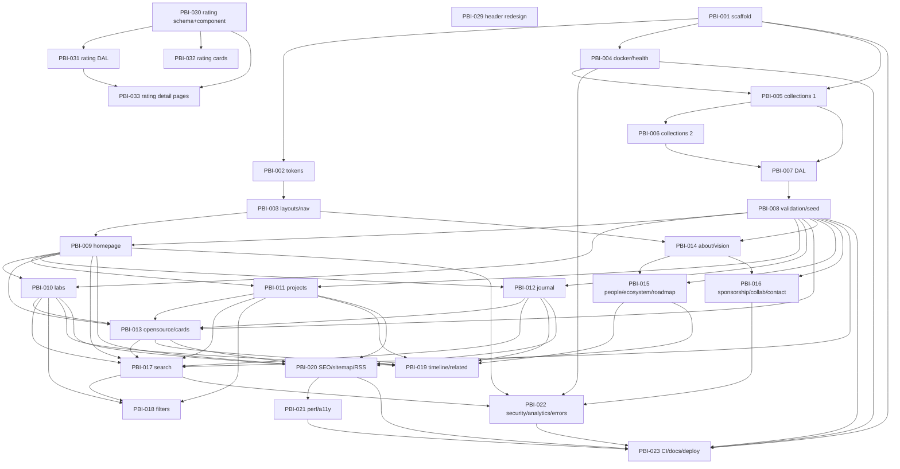

# Plan: KCB Labs Website (labs.kcb.ma) — Implementation

> Sequencing & Plane sync index. Specs are the source of truth; PBIs are the delta. This file is the execution order. `plans/PROGRESS.md` is the Ralph Loop log.
> **Upstream source:** `KCB Labs — Website Product & Technical Specification.md` (79 sections)
> **Decomposed:** 6 Specs + 23 PBIs (Phases 1–6 per spec §70). No milestone hierarchy — sequencing lives here only.

**Bound to Plane:** `kcb / KCBLABS` (`4f8b6bc1-7a02-4822-943d-fb6ab541414f`, identifier `KCBLABS`) — verified via `plane-kcb` MCP on 2026-08-27. **MCP server:** `plane-kcb`. **Backlog ignored until moved to Todo.**

---

## Specs (State)

| Spec | Path | Covers (spec §) | Status |
|---|---|---|---|
| Foundation | `specs/foundation/spec.md` | §25–§29, §31 partial, §33–§34 partial, §42, §47–§48 partial, §53–§58 partial | Proposed — needs human review before PBI-001 |
| Content Model | `specs/content-model/spec.md` | §5–§16, §30, §48–§52 | Proposed |
| Core Public Pages | `specs/core-pages/spec.md` | §4, §17–§22, §31–§32, §36–§38 | Proposed |
| Institutional Pages | `specs/institutional-pages/spec.md` | §3.4–§3.5, §4, §13, §61–§62 | Proposed |
| Interactive Features | `specs/interactive-features/spec.md` | §23–§24, §31, §35, §74 | Proposed |
| Production Hardening | `specs/production-hardening/spec.md` | §37, §39–§40, §59–§60, §63–§67 | Proposed |
| Avionics Design System | `specs/avionics-design-system/spec.md` | Avionics design system application | Proposed — pending human review |
| Header Redesign | `specs/header-redesign/spec.md` | Desktop nav + mobile hierarchical menu | Proposed |
| Entity Rating | `specs/entity-rating/spec.md` | Rating system (Knowledge/Creativity/Business) for core entities | Proposed |

Each spec's **Goal / Scope / Contracts / Anti-patterns / Decisions** are the guardrails; PBIs point at them and must not become stale copies.

---

## Plane Sync

| Plane issue | PBI | Status | Notes |
|---|---|---|---|
| KCBLABS-1 | PBI-001 | Todo | Scaffold Astro + TypeScript + React + Keystatic + Node Adapter |
| KCBLABS-2 | PBI-002 | Todo | Design Tokens & Global Styles (Light/Dark) |
| KCBLABS-3 | PBI-003 | Todo | Core Layouts & Navigation (BaseLayout, Header, Footer, Container) |
| KCBLABS-4 | PBI-004 | Todo | Docker + Health Endpoint + MCP Config Hardening |
| KCBLABS-5 | PBI-005 | Todo | Keystatic Collections — Labs, Research, Experiments, Projects |
| KCBLABS-6 | PBI-006 | Todo | Keystatic Collections — Articles, People, Organizations, Open Source, Roadmap + Singletons |
| KCBLABS-7 | PBI-007 | Todo | Centralized Data Access Layer (src/lib/content) |
| KCBLABS-8 | PBI-008 | Todo | Relationship Validation + Publishing Filters + Slug Stability + Seed Fixtures |
| KCBLABS-9 | PBI-009 | Todo | Homepage — Hero + Current Work + Featured Sections + Numbers |
| KCBLABS-10 | PBI-010 | Todo | Labs Index + Lab Detail (Research Portal) |
| KCBLABS-11 | PBI-011 | Done | Projects Index + Project Detail (Origin, Architecture, Outcomes) |
| KCBLABS-12 | PBI-012 | Todo | Journal Index + Article Detail (Editorial Quality) |
| KCBLABS-13 | PBI-013 | Done | Open Source Index + Detail + Shared Card System Finalization |
| KCBLABS-14 | PBI-014 | Done | About + Vision Pages (Singletons, Editorial Layout) |
| KCBLABS-15 | PBI-015 | Done | People, Ecosystem, Roadmap Pages |
| KCBLABS-16 | PBI-016 | Done | Participate Cluster — Sponsorship, Collaboration, Contact Form |
| KCBLABS-17 | PBI-017 | Done | Build-time Search Index + Search Island |
| KCBLABS-18 | PBI-018 | Done | Explore Filtering — Labs Status + Projects Type/Stage |
| KCBLABS-19 | PBI-019 | Done | Related Discovery + Interactive Timeline (Knowledge Graph Hook) |
| KCBLABS-20 | PBI-020 | Done | SEO Package — Canonical, OG/Twitter, Schema.org, Sitemap, Robots, RSS |
| KCBLABS-21 | PBI-021 | Done | Performance + Accessibility Pass (WCAG 2.2 AA, Core Web Vitals) |
| KCBLABS-22 | PBI-022 | Done | Security Headers, Analytics Abstraction, Error Pages |
| KCBLABS-23 | PBI-023 | Done | CI/CD, Documentation & Coolify Deployment Verification |
| KCBLABS-24 | PBI-024 | Todo | Avionics Tokens — Color Palette & Typography Tokens |
| KCBLABS-25 | PBI-025 | Todo | Avionics Globals — Typography, Grid Layout, Prose |
| KCBLABS-26 | PBI-026 | Todo | KCB Logo & Favicon — Branding Integration |
| KCBLABS-27 | PBI-027 | Todo | Avionics Components — Cards, Badges, Footer, Breadcrumbs |
| KCBLABS-28 | PBI-028 | Todo | Avionics Dark Theme & Final Verification |

- Last sync: 2026-08-27 — push-create via `asdlc-plane` MCP `plane-kcb`. Created 23 Todo issues (KCBLABS-1..23) from `tasks/PBI-*.md`; each PBI Context now contains `Plane: kcb/KCBLABS-N`. No duplicates (Checked `Plane:` link before create). Spec authoritative.
- Next sync: `asdlc-execute` will push status on every PBI transition: `Proposed→Active` → Plane `In Progress`, `Active→In Review` → comment + (if configured) `In Review` (see note), `In Review→Done` sorted by review-type (agentic may close directly, manual stays In Review until human validates). **Note:** project `KCBLABS` currently has no `In Review` state (states: Backlog, Todo, In Progress, Done, Cancelled) — until `In Review` is added, `In Review` PBIs will remain `In Progress` with a `Review: manual — In Review` comment.
- Resolution protocol: `asdlc-plane` only touches `kcb/KCBLABS` (id `4f8b6bc1-7a02-4822-943d-fb6ab541414f`). `Backlog` never pulled until moved to `Todo`.

---

## Execution Order

> Status: `Proposed` → `Active` → `In Review` → `Done` / `Blocked`. Branch naming: `feature/PBI-XXX-short-slug`. Review types sorted during `asdlc-execute` (agentic self-review vs manual human gate).

| # | PBI | Feature | Plane | Status | Depends on | Branch | Review |
|---|---|---|---|---|---|---|---|
| 1 | PBI-001 | Foundation — Astro+React+Keystatic+Node scaffold | kcb/KCBLABS-1 | Done | none | master | agentic |
| 2 | PBI-002 | Foundation — Design tokens & global styles | kcb/KCBLABS-2 | Done | PBI-001 | master | agentic |
| 3 | PBI-003 | Foundation — Core layouts & navigation (BaseLayout/Header/Footer) | kcb/KCBLABS-3 | Done | PBI-001, PBI-002 | master | agentic |
| 4 | PBI-004 | Foundation — Docker + health endpoint + MCP config | kcb/KCBLABS-4 | Done | PBI-001 | master | agentic |
| 5 | PBI-005 | Content Model — Collections Labs/Research/Experiments/Projects | kcb/KCBLABS-5 | Done | PBI-001, PBI-004 | master | agentic |
| 6 | PBI-006 | Content Model — Collections Articles/People/Orgs/OS/Roadmap + Singletons | kcb/KCBLABS-6 | Done | PBI-005 | master | agentic |
| 7 | PBI-007 | Content Model — Data access layer src/lib/content | kcb/KCBLABS-7 | Done | PBI-005, PBI-006 | master | agentic |
| 8 | PBI-008 | Content Model — Validation + publishing filter + slug stability + seed graph | kcb/KCBLABS-8 | Done | PBI-007 | master | agentic |
| 9 | PBI-009 | Core Pages — Homepage (hero, labs, numbers, etc.) | kcb/KCBLABS-9 | Done | PBI-003, PBI-008 | master | agentic |
| 10 | PBI-010 | Core Pages — Labs index + Lab detail (research portal) | kcb/KCBLABS-10 | Done | PBI-008, PBI-009 | master | agentic |
| 11 | PBI-011 | Core Pages — Projects index + Project detail | kcb/KCBLABS-11 | Done | PBI-008, PBI-009 | master | agentic |
| 12 | PBI-012 | Core Pages — Journal index + Article detail | kcb/KCBLABS-12 | Done | PBI-008, PBI-009 | master | agentic |
| 13 | PBI-013 | Core Pages — Open Source index/detail + card system final | kcb/KCBLABS-13 | Done | PBI-008, PBI-009, PBI-010, PBI-011, PBI-012 | master | agentic |
| 14 | PBI-014 | Institutional — About + Vision | kcb/KCBLABS-14 | Done | PBI-003, PBI-008 | master | agentic |
| 15 | PBI-015 | Institutional — People, Ecosystem, Roadmap | kcb/KCBLABS-15 | Done | PBI-008, PBI-014 | master | agentic |
| 16 | PBI-016 | Institutional — Sponsorship, Collaboration, Contact form | kcb/KCBLABS-16 | Done | PBI-008, PBI-014 | master | agentic |
| 17 | PBI-017 | Interactive — Search index + Search island | kcb/KCBLABS-17 | Done | PBI-008, PBI-009, PBI-010, PBI-011, PBI-012, PBI-013 | master | agentic |
| 18 | PBI-018 | Interactive — Explore filtering (Labs/Project) | kcb/KCBLABS-18 | Done | PBI-010, PBI-011, PBI-017 | master | agentic |
| 19 | PBI-019 | Interactive — Related discovery + Timeline + graph hook | kcb/KCBLABS-19 | Done | PBI-010, PBI-011, PBI-012, PBI-013, PBI-015 | master | agentic |
| 20 | PBI-020 | Hardening — SEO (canonical/OG/Schema, sitemap, robots, RSS) | kcb/KCBLABS-20 | Done | PBI-009, PBI-010, PBI-011, PBI-012, PBI-013, PBI-015 | master | agentic |
| 21 | PBI-021 | Hardening — Perf + A11y (WCAG 2.2 AA, Core Web Vitals) | kcb/KCBLABS-21 | Done | PBI-009..PBI-020 | master | agentic |
| 22 | PBI-022 | Hardening — Security headers + analytics + error pages | kcb/KCBLABS-22 | Done | PBI-004, PBI-009, PBI-016, PBI-017 | master | agentic |
| 23 | PBI-023 | Hardening — CI/CD + docs + Coolify deployment verification | kcb/KCBLABS-23 | Done | PBI-001, PBI-004, PBI-008, PBI-020, PBI-021, PBI-022 | master | agentic |
| 24 | PBI-024 | Avionics — Tokens (color palette + typography) | kcb/KCBLABS-24 | Todo | none | master | agentic |
| 25 | PBI-025 | Avionics — Globals (typography, grid layout, prose) | kcb/KCBLABS-25 | Todo | PBI-024 | master | agentic |
| 26 | PBI-026 | Avionics — Logo & favicon branding | kcb/KCBLABS-26 | Todo | PBI-024 | master | agentic |
| 27 | PBI-027 | Avionics — Components (cards, badges, footer, breadcrumbs) | kcb/KCBLABS-27 | Todo | PBI-024, PBI-025 | master | agentic |
| 28 | PBI-028 | Avionics — Dark theme + final verification | kcb/KCBLABS-28 | Todo | PBI-024, PBI-025, PBI-026, PBI-027 | master | agentic |
| 29 | PBI-029 | Header — Redesign desktop nav + mobile hierarchical menu | — | Proposed | none | master | agentic |
| 30 | PBI-030 | Rating — Schema fields + RatingDots component | — | Proposed | none | master | agentic |
| 31 | PBI-031 | Rating — Data access layer integration | — | Proposed | PBI-030 | master | agentic |
| 32 | PBI-032 | Rating — Card component integration | — | Proposed | PBI-030 | master | agentic |
| 33 | PBI-033 | Rating — Detail page header + index page integration | — | Proposed | PBI-030, PBI-031 | master | agentic |

**Recommended start:** `PBI-001` (Foundation scaffold). After `PBI-001`, parallel opportunities:
- `PBI-002` and `PBI-004` can proceed in parallel (disjoint files: `src/styles/*` vs `Dockerfile`/`api/health`)
- `PBI-003` needs both `PBI-001` + `PBI-002`
- After `PBI-008` lands, `PBI-009`/`PBI-014` can start in parallel-ish — `PBI-009` (homepage) and `PBI-014` (about/vision) touch disjoint page trees; `PBI-010`/`PBI-011`/`PBI-012` are parallel-safe (different `src/pages/labs|projects|journal/` dirs) once `PBI-009` has established card stubs.
- `PBI-023` is terminal — only after hardening PBIs.

---

## Dependency Graph



Text fallback: `PBI-001 → PBI-002 → PBI-003 → PBI-009 → {PBI-010,PBI-011,PBI-012} → PBI-013 → PBI-017 → PBI-018` is the longest chain (≈9 deep). Shortest independent chain: `PBI-001 → PBI-004` (≈2). New chains: `PBI-029` (header, standalone), `PBI-030 → {PBI-031, PBI-032, PBI-033}` (rating, ≈3 deep).

---

## Gate Plan

### Deterministic gates (must pass before adversarial/constitutional review)
Every PBI must pass these via `cmd /c "npm.cmd ..."` (PowerShell 5.1 — `.ps1` blocked):
| Gate | Command | Purpose |
|---|---|---|
| Install | `cmd /c "npm.cmd install"` | Node >=20 |
| Type check | `cmd /c "npm.cmd run check"` | `astro check` + `tsc --noEmit` |
| Lint | `cmd /c "npm.cmd run lint"` | ESLint / Astro check (once configured; currently baseline pass) |
| Test | `cmd /c "npm.cmd test"` | Unit + integration (Vitest / node:test — `tests/smoke.test.mjs` baseline, Vitest from PBI-007 onward) |
| Build | `cmd /c "npm.cmd run build"` | `astro build` must succeed with `output: server` + `@astrojs/node` standalone; prerendered routes in `dist/` + server `entry.mjs` |
| E2E (optional) | `cmd /c "npm.cmd run test:e2e"` | Playwright smoke (homepage, labs, projects, journal, search, filters, forms) — from PBI-017/018 onward |
| Health | `GET /api/health` → `{"status":"ok"}` | No third-party deps; Docker + Coolify health check (PBI-004, re-verified PBI-023) |

No PBI may start before a runnable gate exists (AGENTS.md §4). After PBI-001, gates `check`/`build` become real Astro gates (currently stubs).

### Review gates
- **Spec conformance** (critic agent): Does the change match the referred `specs/{feature}/spec.md` Contracts? Are Anti-patterns avoided? Is relationship validation intact?
- **Design system**: Tokens-only, no literal colors/spacing outside `src/styles/`; cards/badges reuse; typography hierarchy respected.
- **Architecture**: `src/lib/content/*` is the only content query surface; Astro primary / React islands only where justified with weakest `client:*`; slugs stable; draft publishing filter enforced.
- **Security**: No `.env`/`KEYSTATIC_*` committed; no secrets in `dist/client`; headers via middleware.

### Human gates
- **Spec review**: Each of the 6 specs requires human review before its first PBI merges (AGENTS.md §5 governance: "Reversed from code for brownfield and reviewed by human before PBI creation" — applies to forward specs too; no code change without spec).
- **Card/design approval**: `PBI-009`/`PBI-013` visual check (Research Lab + Tech Company + Editorial Publication, not Agency/SaaS template).
- **Header design approval**: `PBI-029` visual check — user must confirm the header matches asdlc.io reference before merge.
- **Rating display approval**: `PBI-033` visual check — user must confirm rating dots placement in card and detail page contexts.
- **Deploy approval**: `PBI-023` Coolify domain/port/env wiring requires human confirmation in Coolify dashboard.

---

## Capability Discovery (tools & skills)

Repo gaps extracted from the 79-section spec + existing tooling (`package.json` has only `typescript` + `node --test` smoke):

| Gap | Candidate skill | What it does | Installs | Source | Verdict |
|---|---|---|---|---|---|
| Astro framework scaffolding | `astrolicious/agent-skills@astro` | Astro patterns, config, islands, content collections | 13.7K | vercel-adjacent community (`astrolicious`) | ✅ **Adopted 2026-08-27** — `skills add astrolicious/agent-skills --skill astro -g -a opencode --copy -y` (copied to `~\.agents\skills\astro`) |
| Astro + Clerk (auth, not needed for MVP) | `clerk/skills@clerk-astro-patterns` | Clerk auth on Astro | 10.4K | clerk (official) | Skip — auth is Keystatic/GitHub, not Clerk |
| Testing (unit/integration) | `antfu/skills@vitest` | Vitest patterns & setup | 33.5K | antfu (reputable) | ✅ **Adopted 2026-08-27** — `skills add antfu/skills --skill vitest -g -a opencode --copy -y` + `npm install -D vitest` (44 packages added) |
| E2E | `microsoft/playwright-cli@playwright-cli` | Playwright CLI & test generation | 133.5K | microsoft (official) | ✅ **Adopted 2026-08-27** — `skills add microsoft/playwright-cli --skill playwright-cli -g -a opencode --copy -y` + `npm install -D @playwright/test` (3 packages) |
| E2E best practices | `currents-dev/playwright-best-practices-skill@playwright-best-practices` | Playwright best practices | 76.3K | currents-dev | Deferred — companion to Playwright; install if E2E complexity justifies |
| Keystatic | `fixmyberlin/fixmyskills@keystatic-astro` | Keystatic on Astro | 6 | fixmyberlin | Skip — 6 installs, too niche; rely on Astro MCP + Keystatic docs directly |
| Keystatic | `karero/website-builder@keystatic-setup` | Keystatic setup | 3 | karero | Skip — 3 installs, untrusted for production CMS |

**Adopted tooling (capability discovery → approved 2026-08-27):**
- `astro` skill installed globally for `asdlc-execute` to consult on PBI-001,005,009+ (Astro MCP remains mandatory for API verification).
- `vitest` skill + `vitest` npm devDep installed — cited in `specs/content-model`, `specs/interactive-features`, `specs/production-hardening` Tooling sections; usable from `PBI-007` onward.
- `playwright-cli` skill + `@playwright/test` installed — for `PBI-017`+ E2E smoke; run `npx playwright install` before first E2E PBI if browser binaries needed.
- No third-party planning skills installed (ASDLC-only methodology).

**Codegraph note:** No `.codegraph/` index found (empty repo, expected per onboarding). Structural picture built via `Read`/`Grep`/`Glob` fallback. Suggest `codegraph init` at repo root once `src/` lands (post PBI-001).

---

## Plane Backlog Seed (inputs for asdlc-plan)

> Issues are inputs — the Spec is authoritative. No Todo issues to seed. Future seeds appear here after `Todo` is populated.

```
No candidate issues — 0 Todo found in kcb/KCBLABS on 2026-08-27 (onboarding) and re-checked during asdlc-plan.
```

Upcoming seeds would be listed as:

| Issue | Title | PBI candidate |
|---|---|---|
| — | — | — |

---

## Risks & Open Questions

- **Content velocity vs spec stability:** 9 collections + relationships is the riskiest part; `PBI-005→008` must land early and remain stable — otherwise every page PBI churns. Mitigation: freeze `keystatic.config.ts` after `PBI-008` except via ADR.
- **Keystatic API drift:** Keystatic's Astro integration + GitHub storage APIs are version-sensitive; `PBI-001`/`PBI-005` must verify via MCP before coding, not copy old snippets.
- **Design direction:** Spec §32–§34 wants "Research Lab + Tech Company + Editorial Publication" — highly subjective; needs human design sign-off on `PBI-009` cards/typography before scaling to `PBI-010..013`.
- **Filtering vs search overlap:** Both touch Explore indexes; `PBI-018` must not reimplement `PBI-017`'s index building — filters are predicate + URL sync over already-fetched helper results.
- **Knowledge graph ambition creep:** Spec §74 is explicitly future layer; `PBI-019` must resist shipping a heavy graph lib without ADR — data hook only.
- **Env secrets:** Coolify env var names (`KEYSTATIC_*`) must be confirmed against actual Keystatic GitHub mode at install time; document in `DEPLOYMENT.md` before `PBI-023`.
- **Phase overlap:** MVP (spec §71) requires Labs, Research, Experiments, Projects, Articles, People, Organizations, Open Source + Relationships — so phases cannot be shipped isolated; sequencing above respects dependency depth.

---

## Next Steps (handoff)

1. **Specs reviewed** 2026-08-27 — you confirmed "1 reviewed good".
2. **Capability discovery approved** — 3 candidates installed: `astro` + `vitest` + `playwright-cli` (see Gate Plan). Remaining `npx playwright install` deferred to first E2E PBI.
3. **Plane pushed** 2026-08-27 — 23 Todo issues `KCBLABS-1..23` created and linked in `tasks/PBI-*.md`. Execution sync active per `asdlc-plane` + `asdlc-execute`: every `Proposed→Active` → Plane `In Progress`, every `Active→In Review` → comment with `PBI`/`Branch`/`Commits`/`Review` (agentic vs manual sort), `Done` only on high-confidence agentic review else human validates. Until `In Review` state is added to `KCBLABS`, `In Review` PBIs will stay `In Progress` with `Review: manual — In Review` comment (see Plane Sync note).
4. **Start execution** — recommended `PBI-001` (Foundation scaffold). Execution follows `asdlc-execute` Ralph Loop: Understand → Inspect → MCP → Design → Implement → Test → Build → Review → Commit (micro-commits, deterministic gates + adversarial review, review-type sorting, constitutional review, merge, learning-loop close-out). Say **"start PBI-001"** or **"continue execution"** to run the loop; `asdlc-execute` will auto-sync Plane on each transition.

---

*Generated 2026-08-27 via `asdlc-plan` from `KCB Labs — Website Product & Technical Specification.md` (79 sections). Decomposed into 6 specs + 23 PBIs; updated 2026-08-27 with Plane push (23 Todo) + 3 adopted skills. AGENTS.md constitution + ARCHITECTURE.md as-built honored.*
